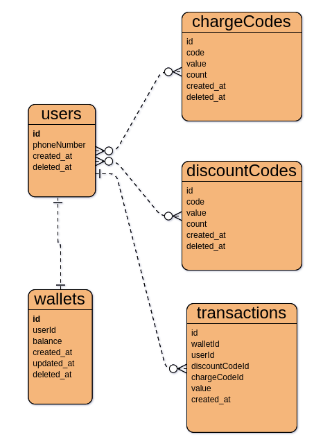

# arvan_challenge

###
### database scheme:


#### generally, this project includes 2 services: <b>wallet</b> and <b>discount</b>.
the wallet service hold responsibility of managing wallets and transactions and discount service is responsible for managing codes, both charge codes and discount codes.

### how to run:

+ run ```npm install``` to install dependancies.
+ run ```npm run dev``` for development mode and ```npm run production``` for production mode.
+ write a .env file like .env.example file.

+ #### you can also run project with ```docker compose up -d --build```