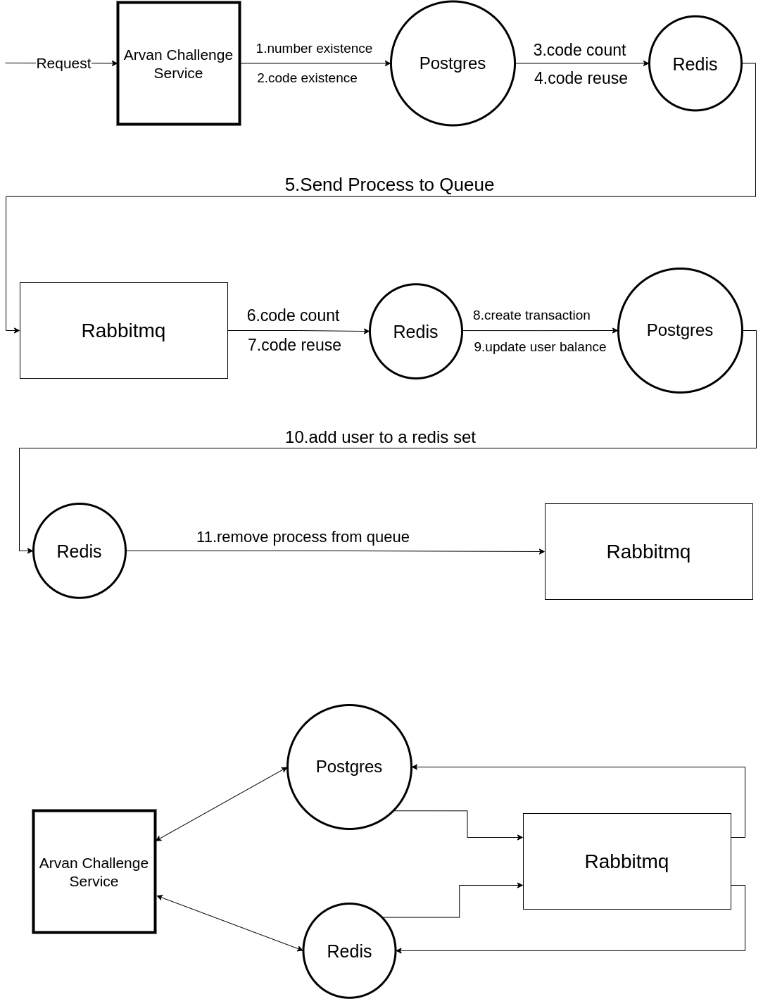

# arvan_challenge

#### generally, this project includes 2 services: wallet and discount.
the wallet service hold responsibility of managing wallets and transactions and discount service is responsible for managing codes, both charge codes and discount codes.

#### system architecture scheme:


#### database scheme:


#### Apis:
you can find Apis in docs folder and see swagger file.

### how to run:

+ run ```npm install``` to install dependancies.
+ write a .env file like .env.example file.
+ run ```npm run dev``` for development mode and ```npm run production``` for production mode.

+ #### you can also run the project with ```docker compose up -d --build```